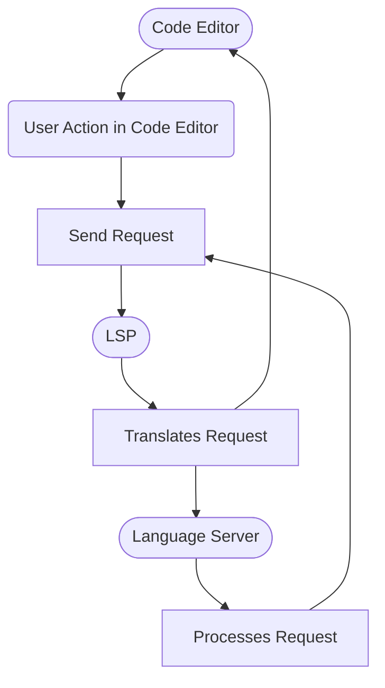

Most of you are using code editors like VSCode or IDEs like PyCharm for coding.
You might be aware of some of the features provided by these applications, such as:

- **Code Completion**:
  Smart suggestions as you type your code (IntelliSense).
- **Syntax Highlighting**:
  Color-coding different elements of your code.
- **Code Formatting**:
  Automatically formats your code based on styling standards (e.g., Prettier).
- **Integrated Debugging**:
  Allows you to set breakpoints and run through your code, making it easier to identify and fix issues in real time.
- **Linting**:
  Automatically detects errors and potential issues in your code, ensuring that you adhere to coding standards and best practices.
- **Code Actions**:
  Provides quick fixes and refactoring suggestions for code issues.
- **Code Navigation**:
  Quickly jump to function and variable definitions for exploring your code.
  Find references to specific symbols (identifiers) in your codebase.

> **How do you think your code editor provides these features?**
> Short answer: **LSP (Language Server Protocol)**.

## What is LSP?

LSP (Language Server Protocol) is a standardized protocol that facilitates communication between development tools (clients) and language servers.
The client represents your code editor or IDE, while the server is responsible for providing language-specific features.
LSP handles functionalities like autocompletion, error checking, and code navigation in a consistent manner.
It is not tied to any particular programming language, enabling multilingual support.
As a universal standard, enhancements to LSP can improve the functionality and behavior of these features across different languages and editors.

## Why It's Important for Code Editors and Modern Development

- **Consistency**:
  LSP provides a uniform way for code editors or IDEs to implement language features, making it easier for developers to use different tools without losing functionality.
- **Efficiency**:
  LSP separates language-specific features from the editor itself, allowing developers to focus on improving language support without modifying the editor. This leads to faster updates and enhancements.
- **Enhanced Developer Experience**:
  LSP enables advanced features like intelligent code completion, on-the-fly error detection, and refactoring tools, significantly improving productivity.
- **Ecosystem Growth**:
  LSP fosters an ecosystem where community-developed language servers can easily integrate with popular editors, promoting broader language support and community contributions.

## But How Does LSP Support Multiple Programming Languages?

- **Language Servers**:
  For each programming language, a separate language server can be developed.
  These servers communicate with the development tools via LSP, providing language-specific features without the need for editor-specific implementations.
- **Standardized Communication**:
  LSP defines a set of standard messages and requests, allowing any language server to work with any editor that implements LSP.
- **Modular Architecture**:
  Developers can create or use existing language servers for the languages they work with, ensuring that features are available regardless of the programming language.
- **Community Contributions**:
  The open nature of LSP encourages developers to create and share language servers, making it easier to support new or niche programming languages.

> Before learning how a code editor interacts with LSP, we need to understand what language servers are.

## What Are Language Servers?

**Language servers** are standalone programs that provide language-specific features to development tools via LSP.
They act as a medium between the code editor and the programming language, enabling enhanced functionality without the editor needing to know the details of the language.

## What Is the Role of Language Servers in Programming?

- **Feature Provider**:
  Language servers offer essential programming features such as:
  - **Autocompletion**:
    Suggesting code completions based on the context.
  - **Syntax Checking**:
    Identifying errors and warnings in real time as you write code.
  - **Code Navigation**:
    Allowing users to quickly jump to definitions, references, and symbols.
  - **Refactoring Tools**:
    Facilitating code transformations like renaming variables or extracting methods.
- **Separation of Concerns**:
  By separating language features from the editor, it allows for easier updates and maintenance.
  Developers can focus on enhancing language support without modifying the editor itself.
- **Consistent User Experience**:
  Language servers ensure that users have a similar experience across different editors by providing a consistent set of features regardless of the tools being used.
- **Community Contributions**:
  Many language servers are open-source and community-driven, allowing for rapid development and support of new programming languages or frameworks.

## How does the LSP connect to the language server?

> All the requests and responses are done using JSON-RPC.
> JSON-RPC (JavaScript Object Notation-Remote Procedure Call

### Language Server Protocol Overview

#### 1. Initialization of Language Server

1. The programming language is detected based on the file type.
2. The Code Editor or IDE initializes the appropriate language server from pre-installed options.
3. An initial request is sent to the language server using JSON-RPC.

#### 2. Request and Response Flow

1. After initialization, various requests are sent to the language server via LSP while coding.
2. Common requests include:
   - Code completion
   - Diagnostics
   - Linting
   - Formatting
3. For each request, the language server responds with the necessary JSON-RPC details.

## Conclusion

By embracing LSP, developers can leverage the full potential of their coding environments, streamline their workflows, and boost productivity.
As LSP continues to evolve, it presents an exciting opportunity for developers to explore new integrations and capabilities, further enhancing their coding experience.
Whether you’re a seasoned programmer or just starting, understanding and utilizing LSP can greatly improve your development journey.
