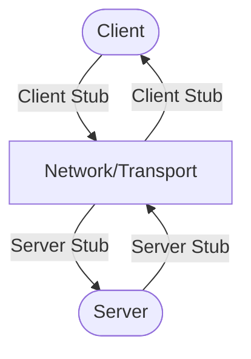

**Have you ever wondered how your computer executes tasks across different devices ?**
Imagine a world where your computer can tap into remote servers for executing functions.

Welcome to the realm of Remote Procedure Calls (RPC) - the unsung hero behind seamless interactions.
From the way Git syncs your projects across devices to how cloud services talk to your favorite apps,
**RPC** is the secret sauce that makes it all happen.

In this post, we’ll unravel the magic of RPC, exploring its details and showcasing the coolest places it’s at work.

## First of all, What is this RPC ?

_"**RPC (Remote Procedure Call)** is a **protocol** that allows one program to **execute a procedure** (function) in another address space (commonly **on another computer on a shared network**) as if it were a local call."_

### It was nerdy right ?

Let's break it down.

1. We write code in various programming languages to perform tasks, which we then organize into smaller and simpler functions that perform specific tasks.
   > The only caveat is that the functions are to be called in the main function for execution.
2. When the number of functions increase, we group these functions into different files based on their usage context and import those functions to the required files for execution.
3. But what if we have functions that requires more CPU cores and memory than what we currently have?

This is where **RPC** comes to the scene, enabling us to run the function on a different computer and get the output on our system

- The computer that provides the function (runs the function) is called the **RPC server**.
- The computer that initiates the function call (requests execution) is called the **RPC client**.

## You asked : Why is RPC a big deal ?

**Me**:
Places Where RPC is Used

1. **Database Systems**

- Supports remote interactions for querying and managing database resources.

2. **File Systems**

- NFS (Network File System): Allows remote file access as if they were local files.

3. **Version Control Systems**

- Git: Uses RPC-like calls to interact with remote repositories for pushing and fetching changes.

4. **Cloud Services**

- Google Cloud: Implements RPC for communication between cloud services and applications.
- Amazon Web Services (AWS): Uses RPC for internal service interactions and resource management.
- Azure Functions: Executes serverless functions remotely through RPC mechanisms.

5. **Remote Desktop and Virtualization**

- Microsoft Remote Desktop Protocol (RDP): Allows users to access and control remote desktop environments.
- VMware: Communicates between virtual machines and management systems via RPC.

6. **Gaming Systems**

- Multiplayer Game Servers: Facilitates real-time communication between players and game instances.
- Unity Networking: Enables RPC for client-server interactions in multiplayer games.

7. **Blockchain Networks**

- Bitcoin: Uses RPC for client interactions with nodes in the Bitcoin network.
- Ethereum: Employs RPC for executing smart contracts and querying blockchain data.

8. **Operating System Services**

- Windows DCOM (Distributed Component Object Model): Allows software components to communicate over a network.
- Linux DBus: Uses an RPC-like mechanism for inter-process communication between applications.

9. **Internet of Things (IoT)**

- Google Cloud IoT: Communicates between IoT devices and cloud services via RPC.

10. **Distributed Systems and Microservices**

- gRPC: A high-performance framework for communication between microservices in different languages.
- Apache Kafka: Uses RPC for message coordination across distributed systems and brokers.

## RPC implementation



> For ease of use, let's use **Python**.

### Thinking through

#### Server

1. Creating a script named `` (You can name it anything you want.) that binds to a specific hostname:port (example: localhost:1331). This is the server that'll listen for requests.
   We can call this RPC Server.

- We can use **socket** module for this purpose.

```python
 import socket

 # Function to run the server
 def run_server(host='localhost', port=1331):
  # Defining server socket.
  server = socket.socket(socket.AF_INET, socket.SOCK_STREAM)
  server.bind((host, port))
  server.listen(5)
  print(f"Listening on {host}:{port}...")

  # Loop for checking client request and print client info.
  while True:
    client_socket, addr = server.accept()
    print(f"Connection from {addr}")


 if __name__ == "__main__":
  print("Starting server...")

 # Add parameters to change the 'host name' and the 'port number'
 run_server()
```

2. We need a format using which the request and response will transfer.
   Let's use **json** module (JavaScript Object Notation).

- We need to encode server's response (Function output) and decode client's request (Function arguments/parameters).

```python
 # Function to handle client connections and execute requested methods.
 import json


 def client_connection_handler(client_socket):
 try:
  # Decoding client json request.
  request = client_socket.recv(1024).decode()

  # Method and argument separation from the request.
  method, *args = json.loads(request)

  # Send response back to client after encoding the response to json format.
  client_socket.send(json.dumps(response).encode())

 except Exception as err:
  client_socket.send(json.dumps(f"Error: {str(err)}").encode())
 finally:
  client_socket.close()
```

3. Now after everything is set, our server will be running but there are no functions to run on this server.
   We need to add any function we want to run on the server.

- For starter why don't we start with some simple mathematical operations.

```python
# Function to add two numbers.
def add(x, y):
 return x+y

# Function to substract two numbers.
def sub(x, y):
 return x - y

```

4. We did implement the functions, but now we have to find a way to execute these functions based on the method provided by the client.

- We can use **if-else** or **switch-case** for function execution by matching the method with a specified keyword of our choice.

```python
# Defining server response based on the client request method.
if method == "add":
 response = add(*args)
elif method == "sub":
 response = sub(*args)
# If the method doesn't match from these two then the method is invalid from the perspective of the server.
# So the method is not available.
else:
 response = "Method invalid."
```

5. We're Done! Server is complete.

- This is how your `server.py` should look like:

```python
import json
import socket

# Functions for remote call

# Function to add two numbers.
def add(x, y):
 return x+y

# Function to substract two numbers.
def sub(x, y):
 return x - y

def client_connection_handler(client_socket):
 try:
  # Decoding client json request.
  request = client_socket.recv(1024).decode()

  # Method and argument separation from the request.
  method, *args = json.loads(request)

  # Defining server response based on the client request method.
  if method == "add":
   response = add(*args)
  elif method == "sub":
   response = sub(*args)
  # If the method doesn't match from these two then the method is invalid from the perspective of the server.
  # So the method is not available.
  else:
   response = "Method invalid."

  # Send response back to client
  client_socket.send(json.dumps(response).encode())

 except Exception as err:
  client_socket.send(json.dumps(f"Error: {str(err)}").encode())
 finally:
  client_socket.close()

# Function to run the server
def run_server(host='localhost', port=1331):
 # Defining server socket.
 server = socket.socket(socket.AF_INET, socket.SOCK_STREAM)
 server.bind((host, port))
 server.listen(5)
 print(f"Listening on {host}:{port}...")

 # Loop for checking client request and print client info.
 while True:
   client_socket, addr = server.accept()
   print(f"Connection from {addr}")


if __name__ == "__main__":
 print("Starting server...")

# Add parameters to change the 'host name' and the 'port number'
run_server()
```

#### Client

1. Creating another script named client.py (You can name it anything you want.) that'll send requests at the same hostname:port.
   We can call this RPC Client.

- Let's use **socket** module to connect to localhost:1331.

```python
 import socket

 def send_request(method,*args):
  # Creating socket
  client = socket.socket(socket.AF_INET, socket.SOCK_STREAM)
  client.connect(('localhost',1331))

  client.close()

  if __name__ == "__main__":
   print("Connection to Server")
   print("Adding 10 and 10:", send_request("add", 10, 10))
   print("Subtracting 10 and 10:", send_request("sub", 10, 10))
```

2. Now, we can't send the function argument as it is.
   We need to encode the request and decode the response to interpret the json file.

- We can use **json** module for this.

```python
import json

request = json.dumps([method] + list(args))
client.send(request.encode())
response = client.recv(1024).decode()
```

3. We're Done! Client is complete.

- This is how your **client.py** should look like:

```python
import socket
import json

def send_request(method,*args):
 # Creating socket
 client = socket.socket(socket.AF_INET, socket.SOCK_STREAM)
 client.connect(('localhost',1331))

 # Prepare the request
 request = json.dumps([method] + list(args))
 client.send(request.encode())

 # Get the response
 response = client.recv(1024).decode()

 client.close()

 return json.loads(response)

 if __name__ == "__main__":
  print("Connection to Server")
  print("Adding 10 and 10:", send_request("add", 10, 10))
  print("Subtracting 10 and 10:", send_request("sub", 10, 10))
```

### Running scripts

After writing those python scripts, you're left to do nothing but to run them.
First run the `server.py` using `python server.py` or `python3 server.py`.

Then run the client.py using `python client.py` or `python3 client.py` and enjoy the output.
Make sure to run them in different terminals cause the server will be continuously listening to **localhost:1331**.

### Project details

Make sure to checkout the project for some additional goodies inside
[GitHub: edu-rpc](https://github.com/penguineo/edu-rpc)

And if you want to explore more exciting projects then follow me on [GitHub](https://github.com/penguineo).
